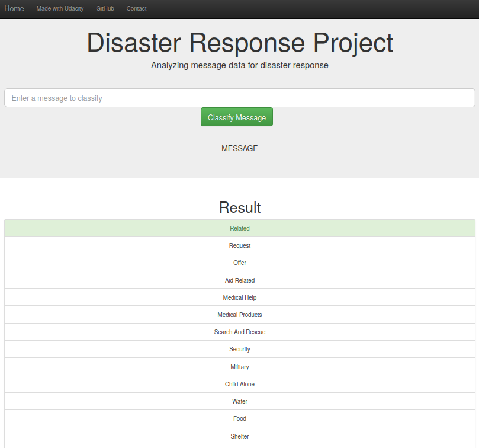
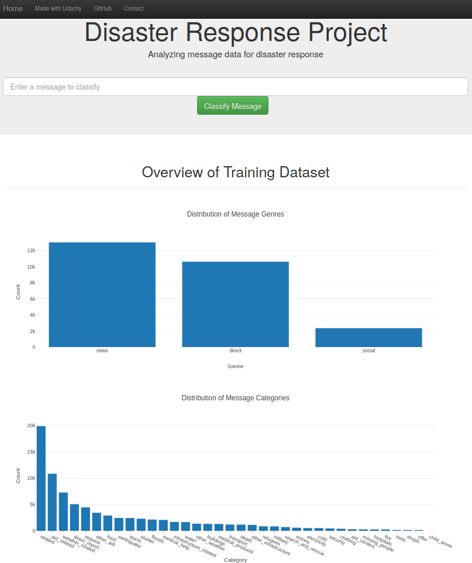

# Disaster Response Pipeline Project

## Overview

In this project we build a web app to analyze messages containing disaster reports. The goal is to correctly classify the message (e.g. label it with a type of disaster reported: natural, military, refugees, etc.) 

The data is provided by [Figure Eight](https://en.wikipedia.org/wiki/Figure_Eight_Inc.). 

The web app contains a field to input a message, then it provides classification results:



The app also provides some visualizations of the data set: 



## Project Structure

```
- app

| - template

| |- master.html  # main page of web app

| |- go.html  # classification result page of web app

|- run.py  # Flask file that runs app


- data

|- disaster_categories.csv  # data to process 

|- disaster_messages.csv  # data to process

|- process_data.py

|- InsertDatabaseName.db   # database to save clean data to


- models

|- train_classifier.py

|- classifier.pkl  # saved model 


- README.md
```

## Python scripts

### ETL pipeline

`process_data.py` : preprocess data and prepares it for training

*Arguments*: 

    `disaster_messages.csv` : tweets reporting a disaster

    `disaster_categories.csv` : categories for each tweet

    `DisasterResponse.db` : path of the DataBase to store preprocessed data

*Example*: `python process_data.py disaster_messages.csv disaster_categories.csv DisasterResponse.db`

### ML pipeline

`process_data.py` : builds a model for multi-label multi-class classification

*Arguments*: 

    `../data/DisasterResponse.db` : path of the DataBase with preprocessed data

    `classifier.pkl` : path of the stored model

*Example*: `python train_classifier.py ../data/DisasterResponse.db classifier.pkl`
