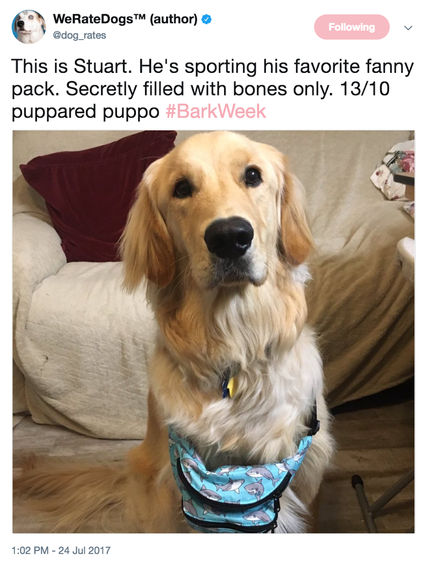

# Project Overview

## Context

The goal is to wrangle WeRateDogs Twitter data to create interesting and trustworthy analyses and visualizations. The Twitter archive is great, but it only contains very basic tweet information. Additional gathering, then assessing and cleaning is required for "*Wow!*"-worthy analyses and visualizations.

## The Data

In this project, we will be working on the following three datasets.

### Enhanced Twitter Archive

The WeRateDogs Twitter archive contains basic tweet data for all 5000+ of their tweets, but not everything. One column the archive does contain though: each tweet's text, from where rating, dog name, and dog "stage" (i.e. doggo, floofer, pupper, and puppo) were extracted to make this Twitter archive "enhanced." Of the 5000+ tweets, tweets with ratings only (there are 2356) were preliminary filtered.

*The extracted data from each tweet's text*

The data were extracted programmatically, but the ratings probably aren't all correct. Same goes for the dog names and probably dog stages (see below for more information on these) too. We will need to assess and clean these columns if we want to use them for analysis and visualization.

*Dogtionary from WeRateDogs book*

The Dogtionary explains the various stages of dog: doggo, pupper, puppo, and floof(er) (via the #WeRateDogs book on Amazon)

### Additional Data via the Twitter API

Back to the basic-ness of Twitter archives: retweet count and favorite count are two of the notable column omissions. Fortunately, this additional data can be gathered by anyone from Twitter's API. Well, "anyone" who has access to data for the 3000 most recent tweets, at least. Because we have the WeRateDogs Twitter archive and specifically the tweet IDs within it, so we can gather this data for all 5000+. We are going to query Twitter's API to gather this valuable data.

### Image Predictions File

One more cool thing: every image in the WeRateDogs Twitter archive was run through a [neural network](https://www.youtube.com/watch?v=2-Ol7ZB0MmU) that can classify breeds of dogs. The results: a table full of image predictions (the top three only) alongside each tweet ID, image URL, and the image number that corresponded to the most confident prediction (numbered 1 to 4 since tweets can have up to four images).

*Tweet image prediction data*

So for the last row in that table:

- tweet_id is the last part of the tweet URL after "status/" → [https://twitter.com/dog_rates/status/889531135344209921](https://twitter.com/dog_rates/status/889531135344209921)
- p1 is the algorithm's #1 prediction for the image in the tweet → **golden retriever**
- p1_conf is how confident the algorithm is in its #1 prediction → **95%**
- p1_dog is whether or not the #1 prediction is a breed of dog → **TRUE**
- p2 is the algorithm's second most likely prediction → **Labrador retriever**
- p2_conf is how confident the algorithm is in its #2 prediction → **1%**
- p2_dog is whether or not the #2 prediction is a breed of dog → **TRUE**

etc.

And the #1 prediction for the image in that tweet was spot on:

*A golden retriever named Stuart*

So that's all fun and good. But all of this additional data will need to be gathered, assessed, and cleaned. That's what we will do in this project.
