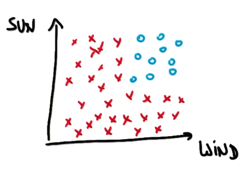
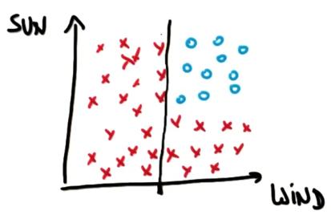
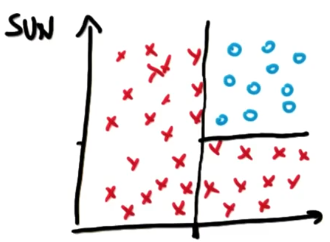
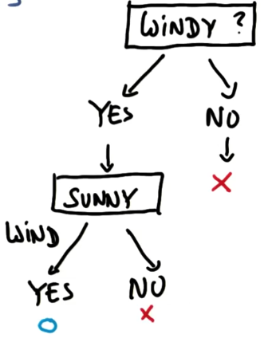
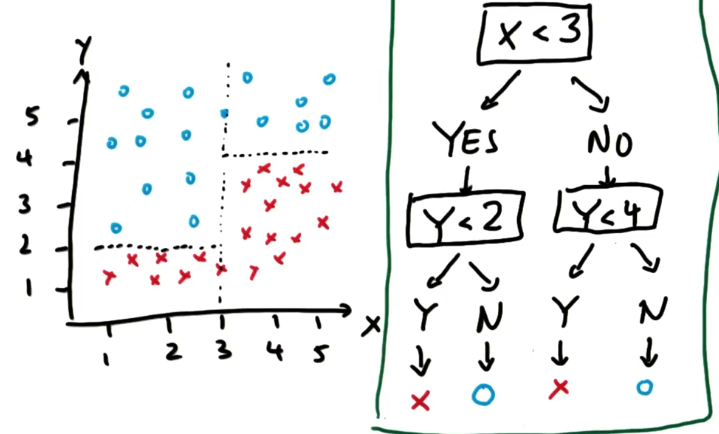

# Decision Tree Algorithm

Suppose you like windsurfing. The essential conditions for this activity are sun and wind. However, if you look at a graph, you may see that the data is not linearly separable.

However, decision trees allow you to ask multiple linear questions. In essence, you can first ask a question "Is it windy?" The answer will put a straight line:

The next question "Is it sunny?" puts another decision boundary:

Our final decision tree looks like this:

More complex data, hence more complex decision tree:

 