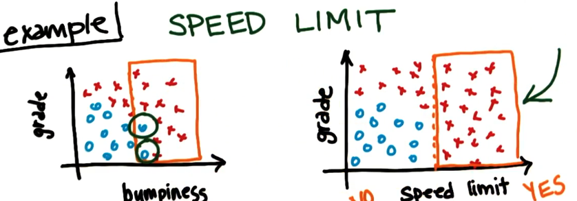
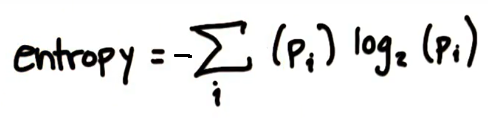
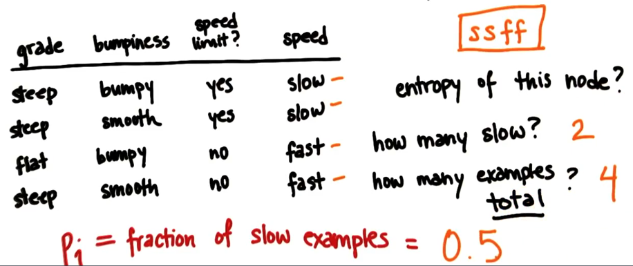
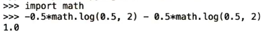

# Decision Tree Algorithm

## Decision making

Suppose you like windsurfing. The essential conditions for this activity are sun and wind. However, if you look at a graph, you may see that the data is not linearly separable.

However, decision trees allow you to ask multiple linear questions. In essence, you can first ask a question "Is it windy?" The answer will put a straight line:

The next question "Is it sunny?" puts another decision boundary:

Our final decision tree looks like this:

More complex data, hence more complex decision tree:

 

## Parameters (implementation)

`min_samples_split`: whether the algorithm should keep splitting after a certain number of samples. High value may allow to avoid overfitting. 

## Entropy

Entropy: a measure of impurity in a bunch of examples. It controls how a DT decides where to split the data. If we have to make a first split of the data, the split by speed limit with result in a subset with more purity (samples of the same class) than if we split by bumpiness. 

When we build a decision tree we are trying to find variables and split points along these variables which are going to make subsets as pure as possible. Repeating this process recursively is how the DT works.

Entropy formula: 

where:
`p_i` is a fraction of examples in class i

If we want all the examples to be of the same class, the entropy would be 0. If the examples are evenly spit between classes, the entropy would be 1. 

**Example of calculating the entropy for Speed class:**

First, we calculate `p_i`:

Last, we calculate the entropy of the node: 

