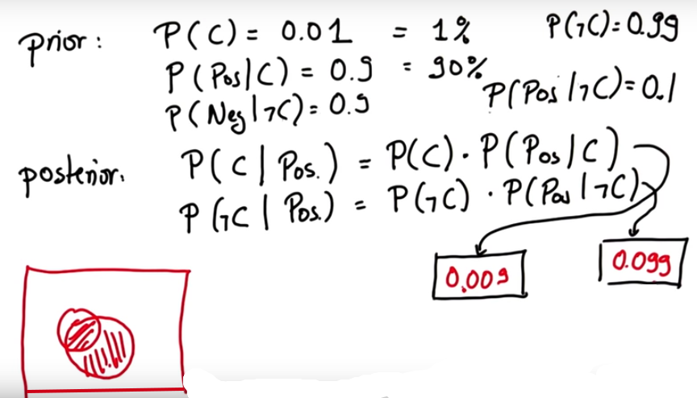

# Bayes Rule

A cancer occurs in 1% of population.

P(C) = 0.01

There is a test to detect if you have this cancer or not. 

**Sensitivity**: with 90% the test is positive if you have cancer.

**Specitivity**: with 90% the test is negative if you don't have cancer. 

If the test comes positive, what is the probability that you have this specific type of cancer?

## Illustration

## Calculations, part 1

However, these probabilities do not sum up to 1. 

What we have just calculated is not really a posterior, but joint probabilities. 

## Calculations, part 2

Now, these posteriors sum up to 1.

