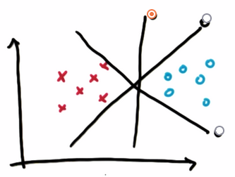
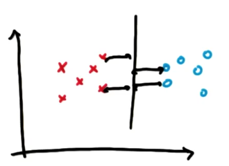
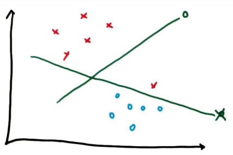
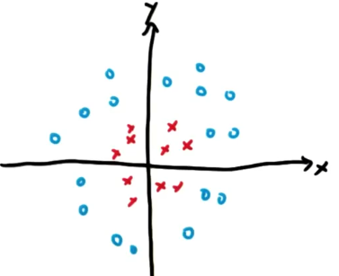
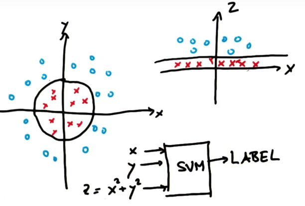
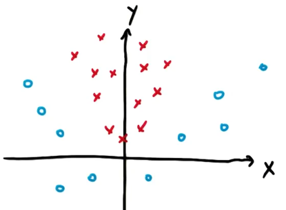
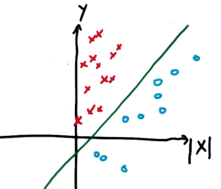

# SVM Algorithm

## Separating line

The goal of Support Vector Machines algorithm is to find a line which separates different classes in the best way. 

THe best line maximizes the distance to the nearest points in both classes. This distance is called *margin*.

Support Vector Machines puts forward the correct classification and then, subject to that constraint, maximizes the margin. 

The other line maximizes to some point the distance between classes but makes a classification error. 

## Outliers 

If the data can not be linearly separated due to outliers, Support Vector Machines will do the best it can. It linearly separates the classes with maximized distance between their points and it is tolerant to outliers - the points that happen to be on the other side. 

## Non linear decision boundary

We need to introduce new features in our feature space. This would be `z = x² + y²`.

In vestor space projection x and z (omitting y) x² will always be small, whereas y² will always be large, since z measures the distance to the origin. The data is now linearly separable. In the original data coordinate system this linear separation would correspond to a circle. 

If we pick such new features we can make our Support Vector Machines learn a non linear separation between classes. 

Other cases of adding new features to get a linear separation: 

Here we need to add an absolute value of x, |x|, to flip all the points along y axis to get a linear separation: 

## Kernel trick (sklearn implementation)

In sklearn there are functions called *kernels*: they allow you to take a alow dimentional feature space which is not linearly separable and map it into a very high dimentional feature space, with a linear separation. 

THe default kernel is `rbf`; there are also `linear` (t odraw a straight line), `poly`, `sigmoid` and much more. 

## Other Parameters (sklearn implementation)
