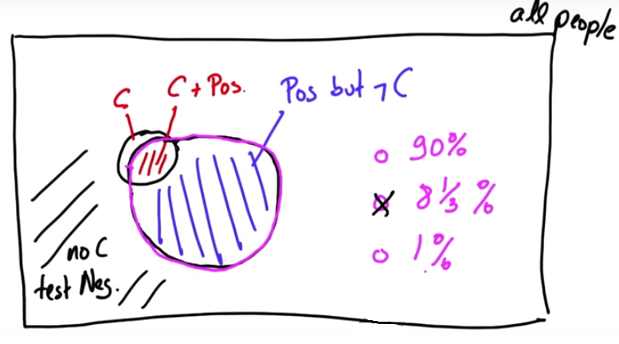
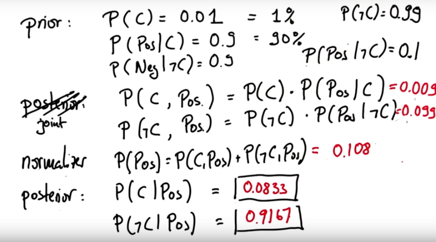
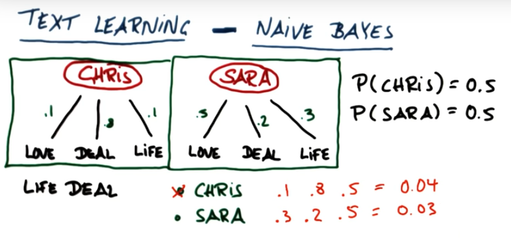
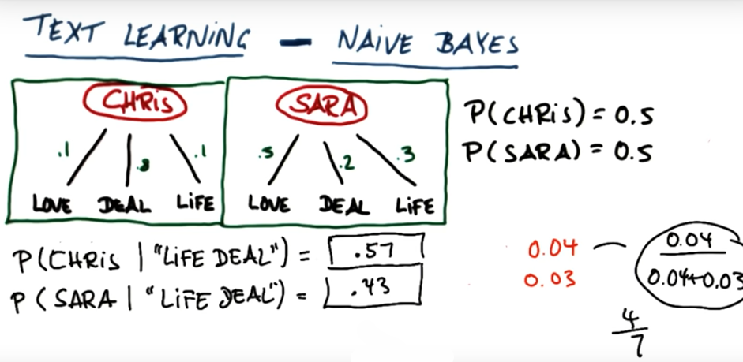

# Bayes Algorithm

A cancer occurs in 1% of population.

P(C) = 0.01

There is a test to detect if you have this cancer or not. 

**Sensitivity**: with 90% the test is positive if you have cancer.

**Specitivity**: with 90% the test is negative if you don't have cancer. 

If the test comes positive, what is the probability that you have this specific type of cancer?

## Illustration

## Calculations, part 1

However, these probabilities do not sum up to 1. 

What we have just calculated is not really a posterior, but joint probabilities. 

## Calculations, part 2

Now, these posteriors sum up to 1.

# Example

We are given with frequencies of words "love", "life", "deal" used by Chris and Sarah. What are the probabilities that the email containing "I made my life deal" is written by Chris or Sarah? Our initial belief is that both of them can write this email with the same probability.

## Joint Probabilities

## Posterior Probabilities

Now we want to calculate the probability of Chris and Sarah writing "love deal" phrase. 

Joint probability for Chris: 0.1 * 0.8 * 0.5 = 0.04

Joint probability for Sarah: 0.3 * 0.2 * 0.5 = 0.03

Total probability: 0.04 + 0.03 = 0.07

Posterior probability for Chris: 0.04 / 0.07 = 0.57

Posterior probability for Sarah: 0.03 / 0.07 = 0.43

