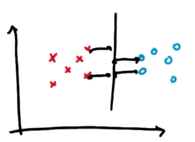
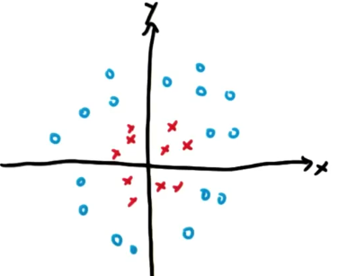
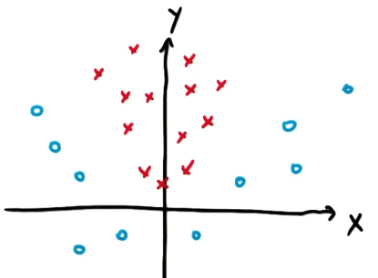
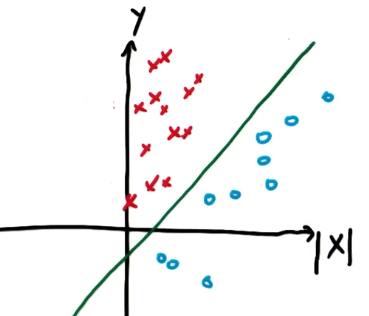
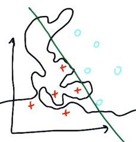

# SVM Algorithm

## Separating line

The goal of Support Vector Machines algorithm is to find a line which separates different classes in the best way. 

The best line maximizes the distance to the nearest points in both classes. This distance is called *margin*.

Support Vector Machines puts forward the correct classification and then, subject to that constraint, maximizes the margin. 

The other line maximizes to some point the distance between classes but makes a classification error. 

## Outliers 

If the data can not be linearly separated due to outliers, Support Vector Machines will do the best it can. It linearly separates the classes with maximized distance between their points and it is tolerant to outliers - the points that happen to be on the other side. 

## Non linear decision boundary

We need to introduce new features in our feature space. This would be `z = x² + y²`.

In vector space projection x and z (omitting y) x² will always be small, whereas y² will always be large, since z measures the distance to the origin. The data is now linearly separable. In the original data coordinate system this linear separation would correspond to a circle. 

If we pick such new features we can make our Support Vector Machines learn a non linear separation between classes. 

Other cases of adding new features to get a linear separation: 

Here we need to add an absolute value of x, |x|, to flip all the points along y axis to get a linear separation: 

## Kernel trick (sklearn implementation)

In sklearn there are functions called *kernels*: they allow you to take a allow dimensional feature space which is not linearly separable and map it into a very high dimensional feature space, with a linear separation. 

The default kernel is `rbf`; there are also `linear` (to draw a straight line), `poly`, `sigmoid` and much more. 

## Other Parameters (sklearn implementation)

Kernel: cf. above

C: it controls tradeoff between smooth decision boundary and classifying training points correctly. Large C means that we will get more training points correct, hence more intricate decision boundary. 

Gamma: it defines how far the influence of a single training example reaches (high value = low reach; low value = even points that are far away from the decision boundary are taken into consideration). High values of gamma may result in a curvy decision boundary, whereas low values - in a more linear decision boundary.

## Overfitting

This means taking data too literal.

Overfitting can be avoided by working with hyper parameters. 

## Limits

SVMs do not perform well in very large data sets because of the training time. One way to speed up an algorithm is to train it on a smaller training data set. The tradeoff is that the accuracy almost always goes down when you do this. If speed is a major consideration (and for many real-time machine learning applications, it certainly is) then you may want to sacrifice a bit of accuracy if it means you can train/predict faster.

SVMs also do not work well with a lot of noise (Naive Bayes would be better)

