# Decision Tree Algorithm

## Decision making

Suppose you like windsurfing. The essential conditions for this activity are sun and wind. However, if you look at a graph, you may see that the data is not linearly separable.

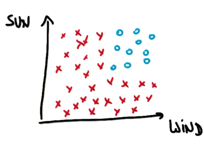

However, decision trees allow you to ask multiple linear questions. In essence, you can first ask a question "Is it windy?" The answer will put a straight line:

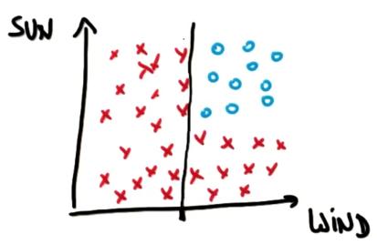

The next question "Is it sunny?" puts another decision boundary:

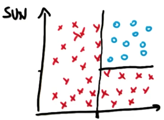

Our final decision tree looks like this:

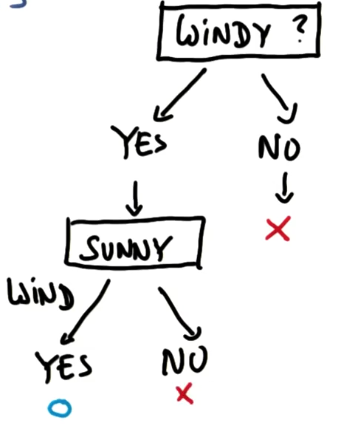

More complex data, hence more complex decision tree:

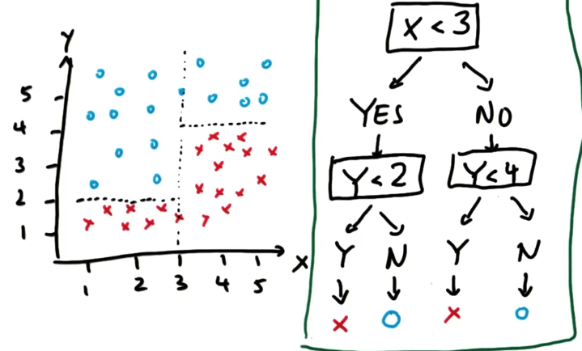 

## Parameters (implementation)

`min_samples_split`: whether the algorithm should keep splitting after a certain number of samples. High value may allow to avoid overfitting. 

## Entropy

Entropy: a measure of impurity in a bunch of examples. It controls how a DT decides where to split the data. If we have to make a first split of the data, the split by speed limit with result in a subset with more purity (samples of the same class) than if we split by bumpiness. 

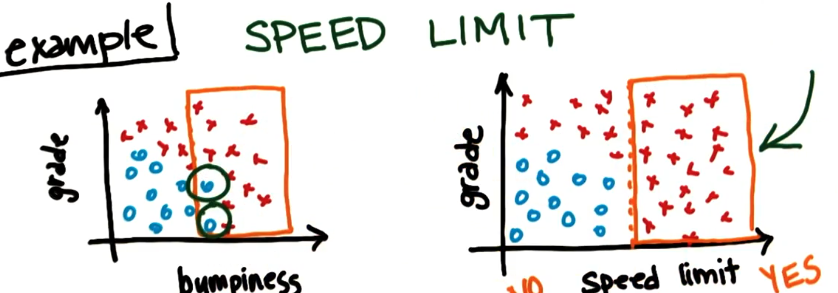

When we build a decision tree we are trying to find variables and split points along these variables which are going to make subsets as pure as possible. Repeating this process recursively is how the DT works.

**Entropy formula**: 

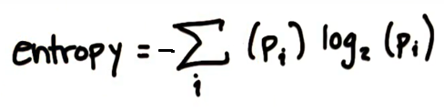

where:
`p_i` is a fraction of examples in class i

If we want all the examples to be of the same class, the entropy would be 0. If the examples are evenly spit between classes, the entropy would be 1. 

**Example of calculating the entropy for Speed class:**

First, we calculate `p_i` ('slow' values in 'speed column'):

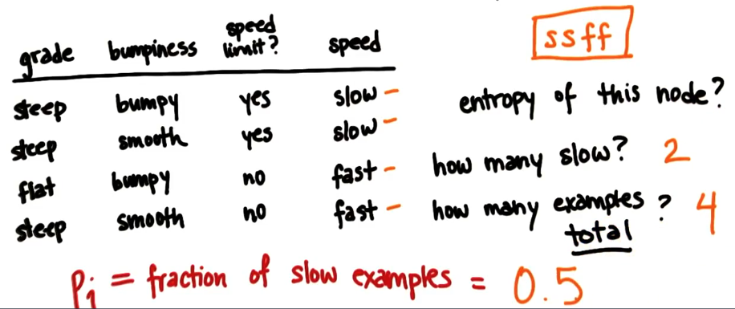

Last, we calculate the entropy of the node: 

## Information gain

Information gain is defined as entropy of the parent minus the weighted average of the entropy of its children. The DT algorithm will maximize the information gain. 

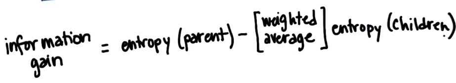

### Information gain based on grade

The entropy of the parent was 1. If we keep splitting by grade, there will be 3 classes in the left node and 1 class in the right node. The entropy of the node on the right will be 0, since all the examples of this node belong to the same class. 

As for the node on the left: `p_slow` = 0.67; `p_fast` = 0.33. 

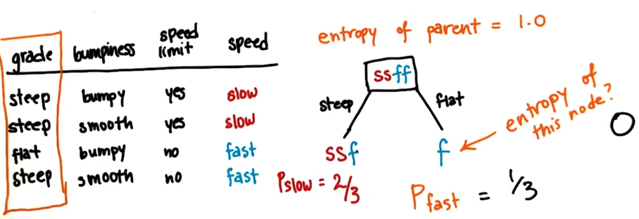

The entropy of the node on the left is therefore: 

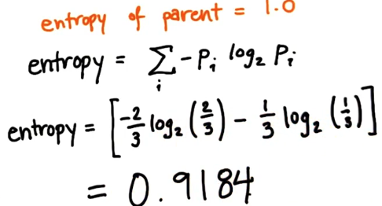

Now we can calculate the information gain of the split based on the grade: 

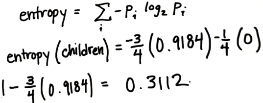

### Information gain based on bumpiness

The entropy of bumpy terrain is 1; the entropy of smooth terrain is also 1. The information gain is 0: we do not learn anything by splitting the examples based on the bumpiness of the terrain. This is not where we would like to start constructing the decision tree. 

### Information gain based on speed limit

If we split by speed limit, we get a perfect purity of the branches. The information gain is therefore equal to 1, the best information gain that we can have, so this is where we want to make a split: 

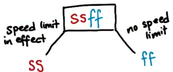

## Strengths and weaknesses of DT

The DT are really easy to use and they graphically allow you to interpret the data really well. But they also have limitations.  They are prone to overfitting, especially with data that has a lot of features. By tuning hyperparameters we need to stop the growth of the tree at the appropriate time 