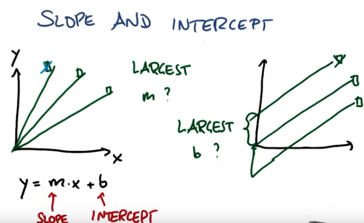
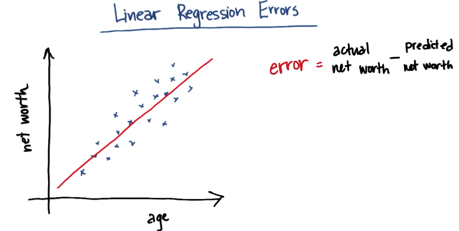
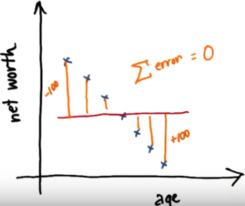
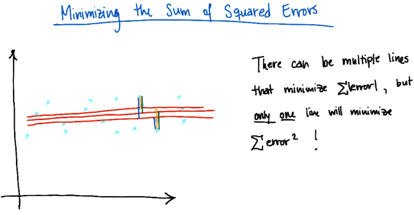
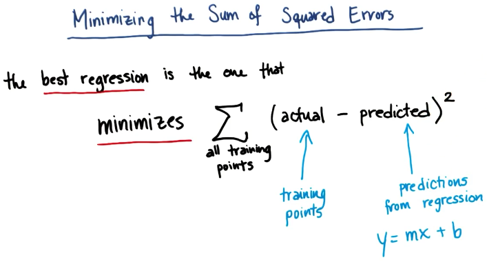
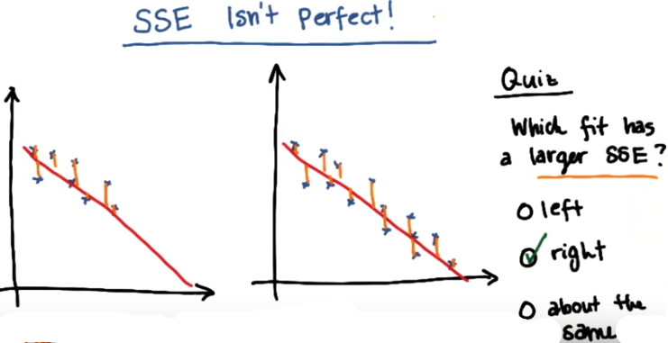

# Linear Regression

## Linear regression formula

## Evaluating linear regression

### Errors and SSE (sum of squared errors)

A good fit will minimize the sum of absolute errors on all data points OR the sum of squared errors on all data points. 

It does not make sens to minimize absolute errors on all data points (they may cancel each other out)

However, the best way to minimize errors is to minimize the sum of squared errors and not the sum of absolute errors. Plus, it is easier computationally. 

 

### Problem with sum of squared errors

As we add more data, the sum of squared errors will almost certainly go up. But it does not necessarily mean that the fit is doing a worse job. 

 

### R squared

R² is a number that answers the question "How much of my change in the output (y) is explained by the change in my input (X)". The values it takes are between 0 (the line isn't doing a good job of capturing trend in data) and 1 (the line does a good job of describing relationship between input and output). 