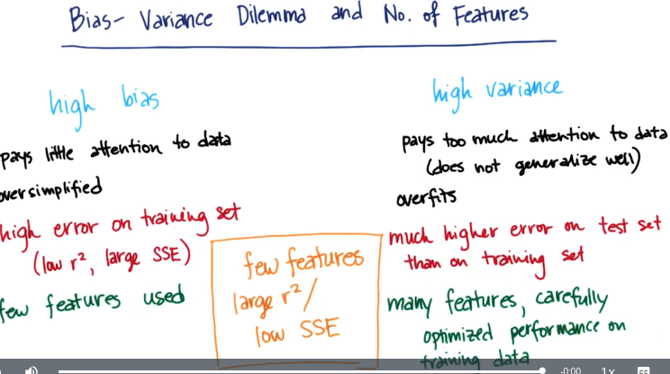

# Bias and variance

## Bias

A high bias machine learning algorithm is one that practically ignores the data. It has no capacity to learn anything. A bias algorithm is the one we can train, and no matter which way we train it, it does not do anything differently. 

## Variance

A high variance algorithm is extremely perceptive to data. It can only replicate stuff it has seen before, it will react very poorly in situations it has not seen because it does not have a right bias to generalize to new stuff. 

## A bias-variance trade-off

In reality we want something in the middle, we want an algorithm that has some authority to generalize but which is still open to listen to the data (with large R², but low SSE). 

## Regularization

