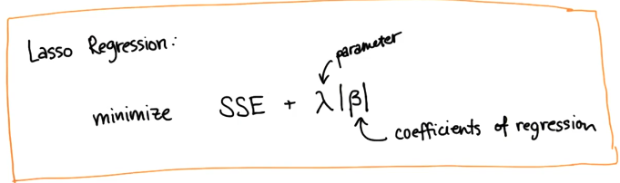

# Bias and variance

## Bias

A high bias machine learning algorithm is one that practically ignores the data. It has no capacity to learn anything. A bias algorithm is the one we can train, and no matter which way we train it, it does not do anything differently. 

## Variance

A high variance algorithm is extremely perceptive to data. It can only replicate stuff it has seen before, it will react very poorly in situations it has not seen because it does not have a right bias to generalize to new stuff. 

## A bias-variance trade-off

In reality we want something in the middle, we want an algorithm that has some authority to generalize but which is still open to listen to the data (with large R², but low SSE). 

## Regularization

Regularization is a method for automatically penalizing extra features

A regular linear regression would just minimize the sum of squared errors. 

Lasso regression also want a small SSE, but in addition it would want to minimize the number of features it uses.  So it add a second term to the equation, which has a penalty parameter and the coefficients of regression (basically, the term that describes how many features are used). 

Lasso regression formulates in a mathematical way the trade off between having small error and having a simpler fit that's using fewer features(which have the most important effect on regression). 

For features that do not help results enough, it sets the coefficients to a very small value (potentially to zero). 

